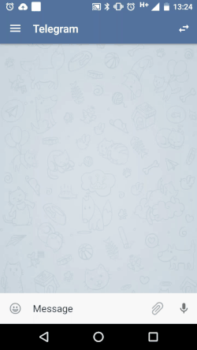
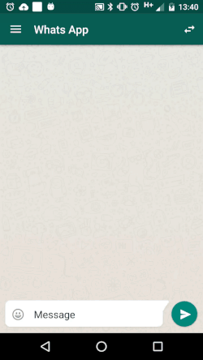

# Android Emoji Keyboard
A library to provide an emoji-keyboard implementation for Android applications

[  ](https://bintray.com/edsilfer/maven/emoji-library/_latestVersion)

<a name="showcase" />

# Showcase
<p align="center">



</p>

# Quicky Setup
```
dependencies {
    compile 'br.com.instachat:emoji-library:1.0.10'
}
```
Refer to the [wiki](https://github.com/instachat/emoji-library/wiki/Development) section.

<a name="third-part-libraries" />

# Third Part Libraries & Special Thanks
* [Rockerhieu / emojicon](#REF1): _Do you like emojis in Whatsapp, iMessage? Emojicon is a library to implement such a thing for Android_;
* [DrKLO / Telegram](#REF2): _Telegram is a messaging app with a focus on speed and security. It’s superfast, simple and free. This repo contains the official source code for Telegram App for Android;_
* [ogaclejapan/ SmartTabLayout](#REF3): _A custom ViewPager title strip which gives continuous feedback to the user when scrolling;_
* [lopspower / CircularImageView](#REF4): _This is an Android project allowing to realize a circular ImageView in the simplest way possible;_
* [square / picasso](#REF5): _A powerful image downloading and caching library for Android;_

<a name="team-members"></a>
# Team Members
* "Fernandes S. Edgar" <fernandes.s.edgar@gmail.com>
* "Leonardo Assunção" <leo.assuncao92@gmail.com>

<a name="license"></a>
# License
Copyright 2015 Edgar da Silva Fernandes | Leonardo Assunção

Licensed under the Apache License, Version 2.0 (the "License");
you may not use this file except in compliance with the License.
You may obtain a copy of the License at

    http://www.apache.org/licenses/LICENSE-2.0

Unless required by applicable law or agreed to in writing, software
distributed under the License is distributed on an "AS IS" BASIS,
WITHOUT WARRANTIES OR CONDITIONS OF ANY KIND, either express or implied.
See the License for the specific language governing permissions and
limitations under the License. 

<a name="references"></a>

# References
<a name="REF1"></a>

* [REF1] - https://github.com/rockerhieu/emojicon
<a name="REF2"></a>

* [REF2] - https://github.com/DrKLO/Telegram
<a name="REF3"></a>

* [REF3] - https://github.com/ogaclejapan/SmartTabLayout
<a name="REF4"></a>

* [REF4] - https://github.com/lopspower/CircularImageView
<a name="REF5"></a>

* [REF5] - https://github.com/square/picasso
